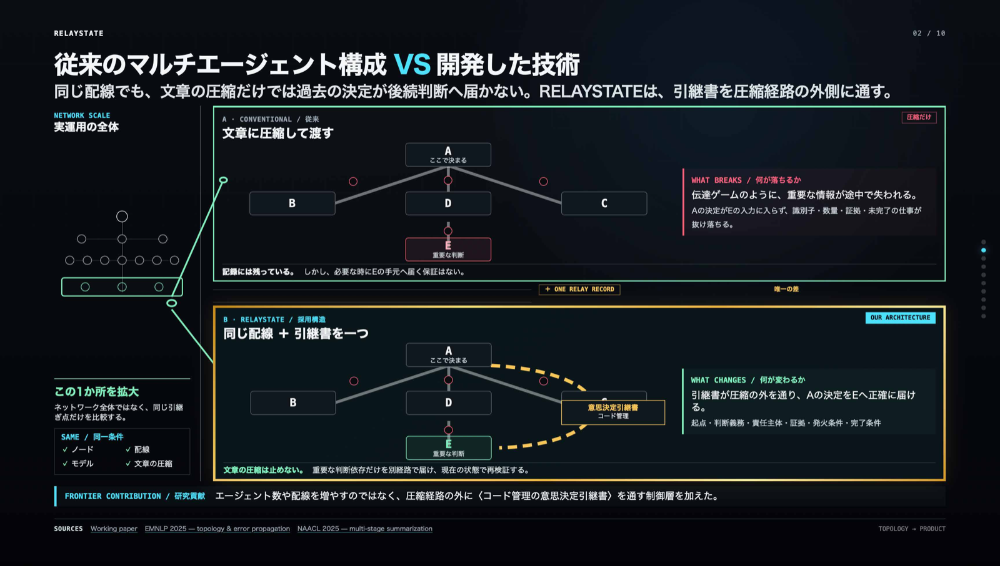

# RELAYSTATE
### 変化を越えて生き残る知能 / Intelligence that survives change

複数のAIエージェントに仕事を分担させる設計は、いま急速に広がっています。
しかしそれを**状況が刻々と変わり続ける現場**へ持ち込むと、この設計は静かに限界を迎えます。
静かに、というのは文字どおりです。**エラーは出ません。**

このREADMEは、その限界を**測定した**記録です。

---

## 5つの問いで、この研究の全体がわかります

### Q1. 「マルチエージェント・オーケストレーション」とは何ですか？

**A.** 1つの仕事を複数のLLMに役割分担させ、**誰が何を読み、誰へ渡し、どの順で、何を検証するか**を
設計することです。本研究では1判断あたり7体を使います。

```
報告を読む Scout ×3  →  根拠を照合する Reviewer ×3  →  行動を決める Coordinator ×1
```

重要なのは、これが「AIを増やすこと」ではなく**「AIとAIの間の配線を決めること」**だという点です。

### Q2. 「状態を持つ複雑系（stateful complex system）」とは何ですか？

**A.** **一つの行動が、次の行動の条件そのものを書き換えてしまう環境**です。
前提も正解条件も固定されません。いま部隊を1つ動かせば、次の判断で使える資源・制約・選択肢が変わります。
災害対応、軌道上の衝突回避、感染症対応、市場リスク——いずれも**刻々と姿を変え続けるシナリオ**です。

> **Q2-1. 環境が変わらない単純なAIタスクと、何が違うのですか？**
> **A.** 単純なタスクでは前提と正解条件がほぼ固定で、答えは環境から独立して採点できます。
> 複雑系では、**判断そのものが未来の採点条件を変えます**（経路依存 / path dependency）。

### Q3. その2つを掛け合わせると、何が起きますか？

**A.** 判断が**連鎖**になります。
いま決めたことが、未来のどこかに「まだ終わっていない仕事」を置いていきます。
別の担当・別の組織・別の時刻の判断者がそれを引き取って閉じなければ、連鎖は完成しません。

**そして、ここで壊れます。**

> **Q3-1. AIエージェントを複数つなげば、それで十分では？**
> **A.** いいえ。接続はメッセージの経路にすぎません。
> 前のAIが残した未完了の仕事を、**将来の状態まで追い続ける仕組み**にはなりません。
> **接続 ≠ 協調。**
>
> **Q3-2. 会話履歴やログに残せば解決しませんか？**
> **A.** いいえ。**記録に残っていることと、いま判断するAIの入力へ正確に届くことは、別のことです。**
> 長い文脈は途中で要約・圧縮されます。散文は残り、**識別子・数量・証拠リンク・未完了義務が落ちます。**
> **保存されている ≠ 実行可能。**
>
> **Q3-3. 具体的には、何が失われるのですか？**
> **A.** 記録は失われません。完璧なまま残ります。失われるのは**実行可能性**です。
> 受け手のモデルは「前に何かがあったらしい」ことは分かっても、
> **「どの部隊を・どの証拠で・何をもって閉じるのか」**を手元に持っていません。
> だから、重要な判断を**確実に実行する能力**が落ちます。

### Q4. なぜ、いまこれを解かなければならないのですか？

**A.** 3つの理由があります。

| | |
|---|---|
| **失敗が見えない** | エラーは出ません。誤配も起きません。記録も完全に残ります。**その仕事だけが永久に終わりません。** 監視やログ監査では捕まりません |
| **規模とともに悪化する** | エージェント数・引き継ぎ回数・経過時間・責任主体が増えるほど、落ちる場所は増えます。**スケールは問題を薄めるのではなく、濃くします** |
| **ユースケースに天井ができる** | だから現在のAI層は、観測・予測・提案までしか任されません。**判断が次の判断を拘束した瞬間、人間が手で持ち直す必要があります。** これが天井です |

いま解くべき理由は、AIをより賢くするためではありません。
**状態を持つ複雑系において、AI層に重要な判断を任せられるようにするため**です。

### Q5. なぜ RELAYSTATE という名前なのですか？

**A.** **RELAY（受け渡し）× STATE（判断の状態）。**

判断が持っていた状態——**誰が・何を・どの証拠で・何が未確定で・何をもって閉じるのか**——を、
**文章圧縮の経路の外側**を通して、次の判断者へそのまま受け渡す。

名前はそのまま、要求仕様です。

---

## 私たちが試したこと — 実在の複雑系を土台にする

試験用の課題を自分で作れば、結果は課題の作り方に左右されます。
そこで、**実際に公開されている複雑系のデータ**を土台にしました。

2026年7月28日 16:27、熊本。
国土地理院の実地形・標高、国土交通省の実道路規制、気象庁の地震列、e-Statの人口、Project PLATEAUの建物モデル。
これら**公的報告・実地形・実道路規制を土台に、状態が変化し続ける72時間の判断環境を再構成**しました。
**414件**のハッシュ連結イベント、**11**の連続した判断。

> **境界を先に書きます。** 人員・派遣・成果は**合成演習データ**です。
> 実際の出動記録ではなく、救われた命の推定でもありません。
> 土台となる地形・道路・地震・人口は実データです。

問いは1つです。

> **マルチエージェント・オーケストレーションは、状態を持つ複雑系で通用するのか。**

4つのオーケストレーション方式 × 8シード = **32回**、最初から最後まで完走させました。

---

## 0. 何が起きたか — そして何を取り除いたか / The bottlenecks



**上下の違いは、引継書が1枚あるかどうかだけです。**
ノードも、配線も、モデルも、文章の圧縮も同一です。文章の圧縮は止めません。
重要な判断依存だけを別経路で届け、**現在の状態で再検証**します。

エージェント数や配線を増やすのではなく、**圧縮経路の外側に制御層を1つ通す**——これが本研究の貢献です。

| ボトルネック | 32回の完走で観測されたこと | 引継書を通したあと |
|---|---|---|
| **接続 ≠ 協調** | 配線を4通り変えても、重要な引き継ぎは1回も成立しませんでした（**0 / 32**） | **8 / 8**、2モデルとも**初回**成立 |
| **保存 ≠ 実行可能** | モデルが返した理由: `"No decision_receipts provided to act on."` 記録にはあり、手元にはない | 起点・証拠・未確定事項・完了条件を、圧縮経路の**外側**から受け手へ届ける |
| **失敗が見えない** | エラー0件・誤配0件。検証器は誤答を全部はじいた。ただ作業だけが終わらない | 根拠のない「完了」**0件**。CONFIRM / DECLINE / ESCALATE を必ず返させる |
| **方式では直らない** | 適応力で**84%**差がついた4方式が、この一点では**全滅** | 方式も配線もモデルも変えず、**層を1つ足すだけ**で成立 |

> **どこまで解けたのか、正確に。** 右列は、**同じ締切時刻における1件の依存関係を8回反復した**検証結果です。
> 経過時間をまたぐ永続化、並行する引継書、競合、再割当は**まだ解けていません**。
> 測定範囲の全体は [§9](#9-測ったこと--これから測ること--measured-and-next) にあります。

```bash
npm ci && npm run verify:numbers   # このREADMEの数字を全部その場で再計算します
```

このREADMEに書かれた数字はすべて、上のコマンドが追跡済みファイルから読み出して表示します。
手で打ち込んだ数字はひとつもありません。
*Every number below is printed by that one command, read from tracked files. None are typed by hand.*

---

## 1. 着想 / Conception

### 1.1 源流 — 自然の成長知能をどう読むか

このプロジェクトは、災害対応の課題からではなく、**生き物の探索の仕方への好奇心**から始まりました。

菌糸・根・粘菌・血管系は、すべてを等しく調べません。
圧力・不確実さ・有望な信号のあるほうへ、**選択的に**成長を向けます。
そして重要なのは、そのときも**冗長性を捨てない**ことです。

私たちはこれを比喩として使わず、**検証可能な情報ルーティング規則**に翻訳しました。

| 生物則 | AIワークフローへの翻訳 |
|---|---|
| 局所感知 Local sensing | 各エージェントが独立に、自分の視界だけで有望な対象を選ぶ |
| 選択的成長 Selective growth | 全員の判断が一致したときだけ、その1点に追加の注意を割く |
| 冗長性 Redundancy | 根拠が少なくとも3つの独立した公的情報源に遡れることを要求する |

最初にこれをベンチマークしたとき、**登録した総合結果は不確定に終わりました**。
しかし診断が示したのは、ルーティングは正しい初期勾配も**誤った初期勾配も等しく増幅する**ということでした
（[論文 §2](docs/rescueworld/RESCUE-WORLD-PAPER-DRAFT.md)）。

そこで問いを変えました。**「注意をどこへ流すか」から、「何が判断者の手元に届いているか」へ。**
生物則は捨てていません。運ぶ中身を変えました。

> この方向転換の結果が[発見1](#発見1--方式によって適応力は大きく変わる)です。
> 上の3規則をそのまま実装した方式（段階的重点化）が、**4方式中もっとも良い成績を出しました。**

### 1.2 問い — 連鎖はどこで切れるのか

> 「遠く離れた領域どうしは、見えない連鎖でつながっています。この連鎖は数式では解けません。」
> — 本ハッカソンのテーマより

私たちはこの「連鎖」を、**義務（obligation）の連鎖**として定義しました（[Q3](#q3-その2つを掛け合わせると何が起きますか)）。

決定的なのは、義務が数値ではなく**意味**として運ばれることです。
「誰が・いつ・何を根拠に・何をもって終えるのか」——これは方程式に入りません。
だからこそ、**意味をそのまま運べるLLMエージェントの世界でしか観測できません**。
そしてこれが、本ハッカソンのテーマが「数式では解けない」と述べていることの、
測定可能な形での言い換えです。

**では、意味は本当に運ばれているのか。** これが検証課題です。

---

## 2. 設計 — 連鎖を観測できる世界 / Design

連鎖の切断を観測するには、**切断以外のすべてを固定**する必要があります。

| 固定したもの / Held fixed | 内容 |
|---|---|
| 世界 | 国土地理院の地形・標高、国交省の道路規制、JMA地震列、e-Stat人口、PLATEAU建物。414件のハッシュ連結イベント |
| 各AIの視界 | その時点までに公開された報告と、自分が過去に通した行動のみ。未来の報告・正解・他方式の状態は見えない |
| 判定 | 決定論的なルール検証コード。資源・宛先・数量・報告リンク・未知事項・引継状態がすべて通ったときだけ、モデル状態が変わる |
| モデル | `Qwen/Qwen3-32B-AWQ` rev `0499c3ac…`、temperature 0.2 / top_p 0.95（[plan JSON](docs/rescueworld/evidence/receipt-fork/receipt-fork-20260828-v1/receipt-fork-plan.json)にピン留め） |
| 再現 | ハッシュ連結リプレイ。全AI入出力を記録 |

| 変えたもの / Varied | 内容 |
|---|---|
| オーケストレーション方式 | 4種（固定分担 / **段階的重点化** / 証拠状態 / 証拠状態＋1回訂正） |
| シード | 8個（51201–51208） |

1判断あたり **7体のLLMエージェント** — 報告を読むScout 3体 → 根拠を照合するReviewer 3体 → 行動を決めるCoordinator 1体。
ランナーとルール検証器はコードであり、エージェントには数えていません。

```
32 完走キャンペーン · 352 採点済み判断 · 2,510 記録済みモデル呼び出し · 414 イベント · 11 連続判断
```

---

## 3. 連鎖の観測 — 3つの発見 / Observation

### 発見1 — 方式によって適応力は大きく変わる

72時間の終了時点に投影された「緊急未充足需要時間」。低いほど良い。固定分担を対照に、シードごとに対で比較。

| 方式 | 固定分担からの削減 | 8対のうち改善した数 |
|---|---:|---:|
| **段階的重点化 Guarded growth**（＝§1.1の生物則の実装） | **84%** | 8 / 8 |
| 証拠状態＋1回訂正 | 79% | 8 / 8 |
| 証拠状態 Evidence state | 75% | 8 / 8 |

**最も成績が良かったのは、菌糸と根から翻訳した3規則をそのまま実装した方式でした。**
局所感知・選択的成長・冗長性を満たしたときだけ1点に注意を集中する。それだけで、
固定分担に対して緊急未充足需要時間を84%削減し、8対すべてで上回りました。

ここまでは「よくできたマルチエージェント比較」です。**問題はこの先です。**

### 発見2 — しかし4方式すべてが、同じ一点で切れた

発災から3.5時間後、同日20:00頃。八代の製紙工場の緊急通報システムが復旧し、
**「すでに割り当て済みの部隊のうち、どれが製紙工場へ到達できるか」**を確認する判断が来ます。

この判断は、**同じ締切時刻に**下された直前の割当判断で名指しされた部隊しか、確認できません。
つまり判断4の出力が、判断5の入力に**正確に**届いている必要があります。

```
出動確認の試行:                    32
ルール検証器が通した数:             0
失敗を回避した方式:                 0     ← 84%差がついた4方式が、ここでは全滅
```

**これが本研究の中心的な観測です。**

適応力を84%改善する設計上の工夫は、この切断に対して**何の効果もありませんでした**。
エージェントを増やしても、配線を変えても、証拠を厳しくしても、生物則を実装しても直りません。
**切断はオーケストレーション方式の外側にあります。**
これは「どの方式が優れているか」という比較結果ではなく、**方式に依存しない構造として観測された不変量**です。

そして最も厄介なのは、**何も壊れて見えないこと**です。
ルール検証器は誤った回答を正しく全部はじきました。だから**誤配は一度も起きていません**。
エラーログも空です。記録も完全に残っています。ただ、その仕事が永久に終わらないだけです。

実際にモデルが返した理由（[analysis JSON](docs/rescueworld/evidence/receipt-fork/receipt-fork-20260828-v1/receipt-fork-analysis.json) の生の値）:

```json
"short_reason": "No decision_receipts provided to act on."
```

前の判断は**記録には残っていました**。ただ、いま判断するモデルの手元には**無かった**。

### 発見3 — 一条件だけ変えると、初回で成立する

有効な先行割当が存在する8つの保存履歴を取り出し、**受け手の判断だけ**を2通り再実行しました。
配線もエージェント数もモデルも同じ。違いは1つだけです。

| | 空の引継欄 | 〈意思決定引継書〉 |
|---|---:|---:|
| Qwen3-32B | 0 / 8 | **8 / 8**（初回成立） |
| Qwen3.5-122B | 0 / 8 | **8 / 8**（初回成立） |
| 根拠のない「完了」 | — | **0件** |

引継書が固定するのは、会話でも要約でもなく、**条件付きの将来義務**です。

| 引継書の項目 | 例（判断5 → 判断6） |
|---|---|
| 何が決まったか | 宮崎の消防大隊1つを、八代の製紙工場へ割り当てる |
| 根拠は | その時点までに届いた、検証済み報告2件（ID指定） |
| 何が未確定か | 未確認の3項目を「不明」のまま保持する |
| 次の仕事は | 条件成立時に、この割当を確認または棄却する |
| どう閉じるか | CONFIRM / DECLINE / ESCALATE を必ず返す |

→ 実際に動く比較: `/relaystate-layer.html`（同一格子を、引継書なし／ありで2回走らせます）

---

## 4. なぜこれが重要か — 判断の空白 / Why this matters

複雑系を扱うAI基盤は、いま2つの層でできています。

| 層 | 何をするか | 現状 |
|---|---|---|
| **入力知能** | 衛星・ドローン・センサーが、世界の現在状態を観測する | 成熟しつつある |
| **予測知能** | シナリオを分岐させ、多数の未来を試す | 成熟しつつある |
| **判断の空白** | AIが決めた後、その義務を**誰がいつ閉じるのか**がシステム間で失われる | ← ここが空いている |

観測の解像度を上げても、未来の本数を増やしても、この空白は埋まりません。
本研究が32回の完走で示したのは、**空白が実在し、方式を変えても消えないこと**です。

RELAYSTATEはこの空白に**1層だけ**足します。
既存の軌道計算・デジタルツイン・シミュレーション・指令権限は**置き換えません**。
判断イベントの後ろに、引継書の生成・保持・再検証・配達を追加するだけです。

```
観測 → 判断 → 〈引継書〉 → （状態が変わる）→ 再検証 → 確認 / 棄却 / 上申
```

**科学的な位置づけ:** 「世界を見るAI」から、「変化の先まで判断を生かすAI」へ。
用途ごとに配線を作り直すのではなく、状態を持つ複雑系に共通する層として設計しています。

---

## 5. 適用領域 — 一人から軌道圏へ / Where this applies

同じ形が、規模を越えて現れます。**状態数・責任主体・時間差・監査要求が増えるほど、空白は広がります。**

| 規模 | 領域 | いまのボトルネック | 引継書を入れると |
|---|---|---|---|
| 個人 | **継続医療** | 担当交代で、未完了の検査や介入が記録に埋もれる | 「記録済み」から「期限・責任・完了条件つき」へ |
| 医療圏 | **感染症対応** | 組織をまたぐ隔離・移送義務が再割当で消える | 警報表示から、所有された地域横断判断へ |
| 大規模群衆 | **Hajj安全運用** | 検知が派遣・処置・再確認まで同じ責任として残らない | 検知から、介入確認または明示的棄却まで |
| 広域 | **災害対応** ← 本研究で測定 | 古い割当は無効化する一方、未解決責任だけが残る | 静的配分から、再検証され続ける判断へ |
| 市場網 | **金融リスク** | 例外がデスクとシステムをまたぎ、終結なく残る | アラートから、監査可能な確認・棄却・上申へ |
| 軌道圏 | **宇宙運用** | データ更新のたび、複数運用者の確認義務が薄れる | 予測から、証拠つき意思決定の終結へ |

**適用条件 / Fit test** — 次の5つが**すべて**揃う環境でのみ有効です。揃わない場所では、この層は不要です。

```
状態変化 × 複数の意思決定主体 × 時間差 × 未完了義務 × 監査可能性
```

> **測定範囲について明示します。** 上の表で**実験的に測定したのは「広域 / 災害対応」の1行だけ**です。
> 他の5行は、同じ5条件を満たす環境として特定した**適用提案**であり、測定結果ではありません。

### 宇宙運用への適用（提案）

軌道上の衝突回避を例に取ります。接近警報の後も、予測位置・衝突確率・回避期限は更新され続けます。
運用者・監視事業者・規制主体が**順番に**判断する複雑系です。
データは更新されますが、**「誰が・何を・いつまでに確認するか」という判断の責任は、担当交代を越えて残りません。**

RELAYSTATEは既存の軌道計算を置き換えません。
その出力から回避判断の引継書を生成し、**最新の追跡状態で再検証して**、次のAIまたは運用者へ届けます。
引継書が固定するのは、分岐ID・起点判断・責任主体・現在証拠・発火条件・完了条件です。

---

## 6. 触って確かめる / Open and click

`npm run dev` のあと <http://127.0.0.1:5184> で開きます。

| ページ | 何が見えるか |
|---|---|
| `/rescueworld.html` | **72時間の世界。** 国土地理院の実地形の上を414イベントが流れ、11の判断を1つずつ開けます。`B` 全判断 / `T` 根拠 / `H` カメラ復帰 |
| `/relaystate-layer.html` | **機構の対比。** 同じ配線を引継書なし（上）／あり（下）で走らせ、左に「終わっていない作業」を積み上げます |
| `/decision-network.html` | **1つの提案の背後にある全作業。** 点はすべて記録済みのモデル呼び出し・ルール検証・状態変化です。見栄えのために足した点はありません |
| `/decision-network-ja.html` | 同じ網を日本語ラベルで、段階的重点化の走行から開きます |
| `/impact-view.html` | キャンペーン全体の結果と、引継書の成立結果 |
| `/decision-run-tree.html` | 記録された判断経路を木構造で |
| [プロセスマップ](docs/rescueworld/ORCHESTRATION-PROCESS-MAP.html) | 1つの判断が次の行動になるまで（初学者向け・サーバ不要） |
| [発表資料](docs/rescueworld/RELAYSTATE-PRESENTATION.html) | 提出スライド（サーバ不要） |

---

## 7. 環境構築と実行 / Setup and run

**必要環境:** Node.js 20 以降（20 / 22 で確認）。GPU・APIキー・ネットワーク接続は**不要**です。
記録済みの実行結果を読み直すだけで、すべての数字を再現できます。

```bash
git clone https://github.com/atomgreyfreeks/relaystate.git
cd relaystate
npm ci
```

| コマンド | 何をするか | 所要 |
|---|---|---|
| `npm run verify:numbers` | READMEの数字を追跡済みファイルから全部再計算して表示 | 数秒 |
| `npm run verify:evidence` | ファイルハッシュ・モデルID・リビジョン・採択件数を照合 | 数秒 |
| `npm run verify:data` | 世界データとリプレイの整合を検証 | 数十秒 |
| `npm run verify` | 上記すべて＋型検査＋ビルド＋同梱物検査 | 1–2分 |
| `npm run dev` | ビューアを <http://127.0.0.1:5184> で起動 | — |
| `npm run test:browser` | ビューアのスモークテスト | — |

冷たい状態から確認したい場合は、`npm ci && npm run verify` の1行で足ります。

---

## 8. 実行結果・生ログ・解析データ / Logs and analysis data

| ファイル | 中身 |
|---|---|
| `product/disaster-replay/runs/kumamoto-2026-full-incident/260728-72h/timeline.jsonl` | 414行のハッシュ連結イベント。1行1イベント、各行に `event_sha256` |
| `product/disaster-replay/runs/*/certificate.json` | 実行証明書（入力ハッシュ・最終状態ハッシュ） |
| `public/decision-network-data.json` | 32キャンペーン分の全作業。3,686ノード / 5,150エッジ、判断ごとの検証結果つき |
| `public/impact-view-data.json` | シード対ごとの成果（発見1の元データ） |
| `docs/rescueworld/evidence/receipt-fork/*/[…]-plan.json` | 引継書フォークの実行計画。モデルID・リビジョン・温度・シード・アーム・ジョブ順序をピン留め |
| `docs/rescueworld/evidence/receipt-fork/*/[…]-analysis.json` | ジョブ単位の結果。モデルが返した判断・違反コード・採択可否・呼び出し回数 |
| `experiment/results/production-analysis.json` | 先行する事前登録ベンチマークの結果（研究履歴として保存） |
| `product/disaster-replay/schemas/`, `.../tests/` | スキーマと検証テスト |

**含まれていないもの（明記します）:** モデルの**プロンプトと生の応答テキスト**は同梱していません。
同梱しているのは、ハッシュでピン留めされた実行計画と、ジョブ単位で構造化された判断結果・違反コードです。
公開した数字を1つ残らず数え直すには十分ですが、モデルの散文をそのまま読み返すには不十分です。

*Not included, stated plainly: raw prompt and completion text. Included: the hash-pinned run plan
and the per-job structured decision with violation codes — enough to recount every published
number, not enough to re-read the model's prose.*

---

## 9. 測ったこと / これから測ること / Measured and next

私たちが**測定したこと**は、次の3つです。

1. 状態を持つ72時間の連続キャンペーンで、オーケストレーション方式は適応力を大きく変える（84% / 8対8）。
2. **にもかかわらず、ある一点の引き継ぎは方式を問わず失敗する**（0/32）。エラーも誤配も出さずに。
3. 検証済みの依存を引継書として受け手に渡すと、2モデルとも初回で成立する（0/8 → 8/8、誤終結0）。

**まだ測っていないこと**は、次の通りです。過小にも過大にも述べません。

- 2つの判断は**同じ締切時刻**を共有しています。**経過時間をまたぐ記憶の検証ではありません。**
- 8回の実行は**同一内容の引継書**を使っています。1つの引き継ぎを8回反復した標本であり、独立した8事例ではありません。
- 対照群は**その事実にまったくアクセスできません**。したがって「書式が効いた」のか「答えを与えた」のかを分離できません。
- 2モデルとも**Qwen系統**です。系統をまたぐ再現ではありません。
- 発見1の84%は**この演習内のモデル化された作業量**の結果です。救われた命でも、実際の出動でもありません。
- モデル化された部隊・派遣・成果は演習上の構成物です。**人ではありません。**
- 永続化・並行する引継書・競合・再割当・実運用効果は**未検証**です。
- この確認事例に限れば、**LLMは必須ではありません**。コードでも同じ転記はできます
  （[論文 §6.4](docs/rescueworld/RESCUE-WORLD-PAPER-DRAFT.md)）。本実験が問うたのは、
  既存のLLM工程が既知の依存を忠実に消費し、現在の観測に結び直し、必要な処分を返せるかどうかです。

次の実験（事実を揃えた対照群、能動的な棄却、時間をまたぐ永続化）は
[論文](docs/rescueworld/RESCUE-WORLD-PAPER-DRAFT.md) §12 に仕様として書いてあります。

境界を先に書いているのは、この結果を弱く見せるためではありません。
**32回の完走で観測された不変量が本物であることを、読み手が自分で確かめられるようにするため**です。

---

## 10. さらに読む / Read more

| 時間 | 読むもの |
|---|---|
| 2分 | [ONE-SHEET](docs/rescueworld/ONE-SHEET.md) — 何であるか、正確な数字、主張してはいけないこと |
| 10分 | [START-HERE](docs/rescueworld/START-HERE.md) — 全体の索引 |
| 30分 | [FULL-NARRATIVE](docs/rescueworld/FULL-NARRATIVE.md) — 成長知能から始まった経緯を平易に |
| 全部 | [論文ドラフト](docs/rescueworld/RESCUE-WORLD-PAPER-DRAFT.md) — 手法・結果・妥当性への脅威・主張の境界 |
| 32回の走行で何が起きたか | [CONTINUOUS-CAMPAIGN-FINDINGS](docs/rescueworld/CONTINUOUS-CAMPAIGN-FINDINGS.md) — 発見1の詳細 |

---

## 11. 構成 / Layout

```
rescueworld.html            72時間ビューア
public/                     その他のビューアと焼き込み済みデータ
src/rescueworld/            ビューア実装
scripts/                    検証コマンド
docs/rescueworld/           読み物・発表資料・証拠バンドル
docs/internal/              制作時の仕様書と原稿（読むのに必要ではありません）
product/disaster-replay/    封印済みリプレイデータ、スキーマ、証明書、検証器
experiment/                 先行する事前登録ベンチマーク（研究履歴）
```

## データと帰属 / Data and attribution

地形・道路規制・避難所・建物モデルは、国土地理院・国土交通省・Project PLATEAU・気象庁・e-Stat の
**実際の公開データ**です。記録内のAI判断は**すべて明示的にシミュレーションであり、そう表示されています**。
[`NOTICE.md`](NOTICE.md) および
[`product/disaster-replay/DATA-SOURCES.md`](product/disaster-replay/DATA-SOURCES.md) を参照してください。

このリポジトリを編集する人向けの作業ノートは [`AGENTS.md`](AGENTS.md) にあります。
